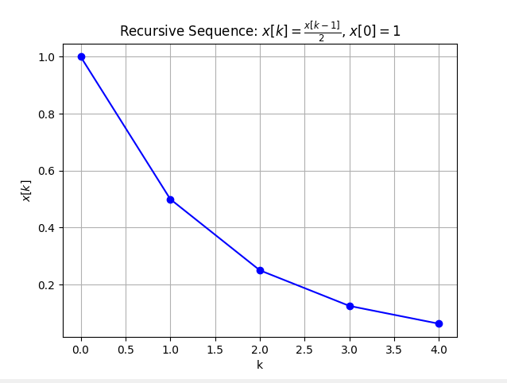
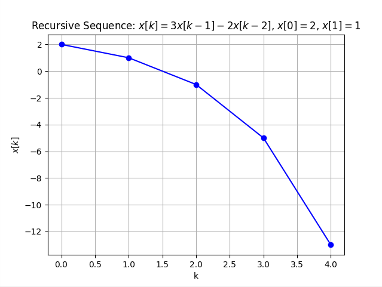

# Mathematics Week 1
## 1
$f(t) = cos(t+2), t ∈ R$   
$f(0) = 1$   
$f(1) = -0.9899$   
$f(2) = -0.6536$   
$f(3) = 0.28366$   
$f(4) = 0.96017$   
$f(5) = 0.75390$   

## 2
$x(k)= {k^2 \over 2} + k$   
$x(0) = 0$   
$x(1) = {3 \over 2}$  
$x(2) = 4$  
$x(3) = {15 \over 2}$  
$x(4) = 12$  

## 3a
$x[k] = {x[k − 1] \over 2}, x[0] = 1$  
$x[1] = {x[1-1] \over 2} = {x[0] \over 2} = {1 \over 2}$  
$x[2] = {x[2-1] \over 2} = {x[1] \over 2} = {{1 \over 2} \over 2} = {1 \over 4} $  
$x[3] = {x[3-1] \over 2} = ... = {1 \over 8}$  
$x[4] = {x[4-1] \over 2} = ... = {1 \over 16}$  

## 3b
$x[k] = 3x[k − 1] − 2x[k − 2]$  
$x[0] = 2$  
$x[1] = 1$  
$x[2] = 3x[1]-2x[0] = 3(1)-2(2) = -1$  
$x[3] = 3x[2]−2x[1] = 3(−1)−2(1) = −5$  
$x[4] = 3x[3]−2x[2] = 3(−5)−2(−1) = −13$  

## 4a
$(a) 8,11,14,...$  
$a_n​ = a_1 ​+ (n−1)d$ || $a_1 = 8, d = 3$  
$a_{10} = 8 + (10-1)⋅3 = 35$  
$a_{19} = 8 + (19-1)⋅3 = 62$  

## 4b
$(a) 8,5,2,...$  
$a_n​ = a_1 ​+ (n−1)d$ || $a_1 = 8, d = -3$  
$a_{10} ​= 8+(10−1)⋅(−3) = -19$  
$a_{19} ​= 8+(19−1)⋅(−3) = -46$  

## 5
$a_n​=a_1​⋅r^{(n−1)}$ || $a_1 = 8,  r = {1 \over 2}$  