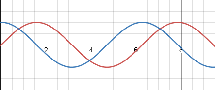
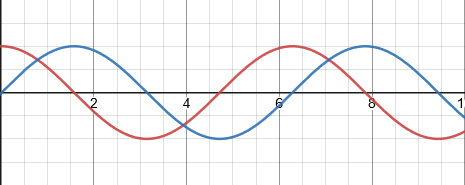
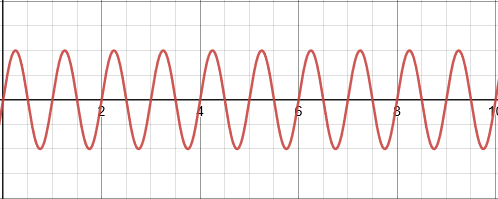
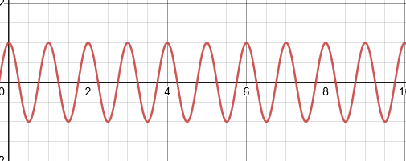

# Week 1
## 1a
$15$°$={{\pi}\over{12}}$
## 1b
${5{\pi}\over{2}}=450°$
## 2a
Red = sin($\theta$) 
Blue = sin($\theta$+${{\pi}\over{2}}$)  

## 2b
Red = cos($\theta$) 
Blue = cos($\theta$-${{\pi}\over{2}}$)  

## 3
Red = sin(${2}\times{\theta}$) 
Blue = cos(${{1}\over{2}}\times{\theta}$)

## 4a

## 4b

## 5a
3sin(2t) 
amplitude = 3 
angular frequency = 2 
frequency = ${2}\over{2{\pi}}$ 
phase angle = 0 
time dispacement = ${-0}\over{2}$ = 0

## 5b
4cos($\pi{t}+4$) 
amplitude = 4 
angular frequency = $\pi$ 
frequency = ${{\pi}\over{2\pi}}$ 
phase angle = 4 
time dispacement = 0

## 6
a) Amplitude = 15. 
b) Angular frequency $\omega$ = ${20}\pi$ 
c) Period T = $2{\pi}\over{20}{\pi}$ = ${1}\over{10}$ 
d) Phase angle $\Phi$ = 4 
e) Time displacement = $-{2{\pi}\over{20}{\pi}}$ = $-{{1}\over{5}{\pi}}$ 
f) Min value = Min val of sin is -1 = ${15}\times{(-1)}$

## 7
